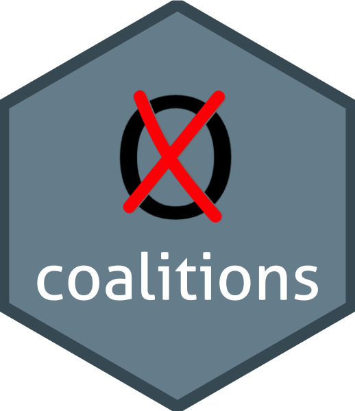

# coalitions 

[](http://www.repostatus.org/#active)
[](https://travis-ci.org/adibender/coalitions)
[](https://ci.appveyor.com/project/adibender/coalitions)
[](https://codecov.io/github/adibender/coalitions?branch=master)
[](https://cran.r-project.org/package=coalitions)
[](http://opensource.org/licenses/MIT)
[](https://doi.org/10.5281/zenodo.1188812)

## Overview

The package offers functions that calculate coalition probabilities in
multi-party elections, based on a survey results:

  - See our [talk](https://adibender.netlify.com/talk/appliedr-meetup/)
    at the [Munich AppliedR
    MeetUp](https://www.meetup.com/de-DE/Applied-R-Munich/)

  - Check out our [interactive shiny app on German
    elections](http://koala.stat.uni-muenchen.de/)\!

  - To get started, see our [workflow
    vignette](https://adibender.github.io/coalitions/articles/workflow.html)

## Installation

Install from GitHub using:

``` r
devtools::install_github("adibender/coalitions")
```

## Usage

Detailed workflow is outlined in the
[workflow](https://adibender.github.io/coalitions/articles/workflow.html)
vignette.

A short overview is presented below.

### Scrape surveys

The wrapper `get_surveys()` which takes no arguments, downloads all
surveys currently available at
[wahlrecht.de](http://www.wahlrecht.de/umfragen) and stores them in a
nested `tibble`:

``` r
library(coalitions)
library(dplyr)
library(tidyr)
surveys <- get_surveys()
surveys
```

    ## # A tibble: 7 x 2
    ##   pollster   surveys           
    ##   <chr>      <list>            
    ## 1 allensbach <tibble [42 × 5]> 
    ## 2 emnid      <tibble [225 × 5]>
    ## 3 forsa      <tibble [235 × 5]>
    ## 4 fgw        <tibble [83 × 5]> 
    ## 5 gms        <tibble [96 × 5]> 
    ## 6 infratest  <tibble [110 × 5]>
    ## 7 insa       <tibble [303 × 5]>

Each row represents a polling agency and each row in the `surveys`
column again contains a nested `tibble` with survey results from
different time-points:

``` r
surveys %>%
    filter(pollster == "allensbach") %>%
    unnest()
```

    ## # A tibble: 42 x 6
    ##    pollster   date       start      end        respondents survey         
    ##    <chr>      <date>     <date>     <date>           <dbl> <list>         
    ##  1 allensbach 2018-02-23 2018-02-02 2018-02-15       1271. <tibble [7 × 3…
    ##  2 allensbach 2018-01-25 2018-01-05 2018-01-18       1221. <tibble [7 × 3…
    ##  3 allensbach 2017-12-21 2017-12-01 2017-12-14       1443. <tibble [7 × 3…
    ##  4 allensbach 2017-11-30 2017-11-22 2017-11-27       1299. <tibble [7 × 3…
    ##  5 allensbach 2017-10-25 2017-10-07 2017-10-19       1454. <tibble [7 × 3…
    ##  6 allensbach 2017-09-22 2017-09-13 2017-09-20       1074. <tibble [7 × 3…
    ##  7 allensbach 2017-09-19 2017-09-06 2017-09-14       1083. <tibble [7 × 3…
    ##  8 allensbach 2017-09-06 2017-08-22 2017-08-31       1043. <tibble [7 × 3…
    ##  9 allensbach 2017-08-22 2017-08-04 2017-08-17       1421. <tibble [7 × 3…
    ## 10 allensbach 2017-07-18 2017-07-01 2017-07-12       1403. <tibble [7 × 3…
    ## # ... with 32 more rows

``` r
survey <- surveys %>% unnest() %>% slice(1)
survey %>% unnest()
```

    ## # A tibble: 7 x 8
    ##   pollster   date       start      end        respondents party  percent
    ##   <chr>      <date>     <date>     <date>           <dbl> <chr>    <dbl>
    ## 1 allensbach 2018-02-23 2018-02-02 2018-02-15       1271. cdu      32.0 
    ## 2 allensbach 2018-02-23 2018-02-02 2018-02-15       1271. spd      17.5 
    ## 3 allensbach 2018-02-23 2018-02-02 2018-02-15       1271. greens   12.0 
    ## 4 allensbach 2018-02-23 2018-02-02 2018-02-15       1271. fdp      11.0 
    ## 5 allensbach 2018-02-23 2018-02-02 2018-02-15       1271. left      9.50
    ## 6 allensbach 2018-02-23 2018-02-02 2018-02-15       1271. afd      13.0 
    ## 7 allensbach 2018-02-23 2018-02-02 2018-02-15       1271. others    5.00
    ## # ... with 1 more variable: votes <dbl>

### Calculate coalition probabilities

For each survey (row) we can calculate the coalition probabilities

``` r
survey %>% get_probabilities(nsim=1e4) %>% unnest()
```

    ## # A tibble: 6 x 4
    ##   pollster   date       coalition       probability
    ##   <chr>      <date>     <chr>                 <dbl>
    ## 1 allensbach 2018-02-23 cdu                  0.    
    ## 2 allensbach 2018-02-23 cdu_fdp              0.0500
    ## 3 allensbach 2018-02-23 cdu_fdp_greens     100.0   
    ## 4 allensbach 2018-02-23 spd                  0.    
    ## 5 allensbach 2018-02-23 left_spd             0.    
    ## 6 allensbach 2018-02-23 greens_left_spd      0.
